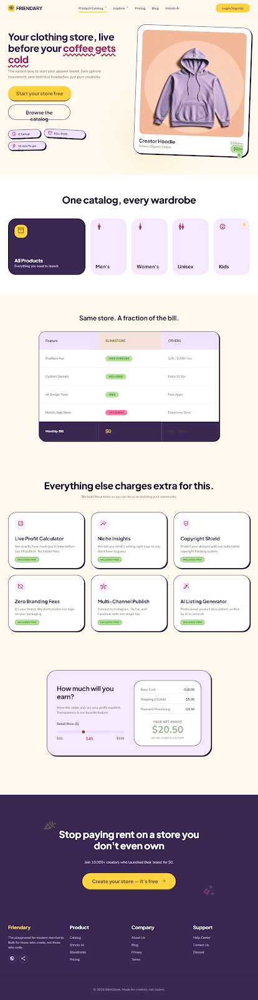

# 👕 Friendary | Original Designs, Printed Fresh

Welcome to **Friendary**, a delightful, warm, and highly-interactive customizable print shop website. Rejecting the cold, sterile efficiency of modern SaaS platforms, Friendary is built on the philosophy of **"Digital Craftsmanship"**—evoking the nostalgic feeling of picking up a freshly printed shirt or sticking a custom decal onto a notebook.



---

## ✨ Features

### 🛒 Client Portal (`code.html`)
- **Interactive Shop Experience:** Browse clothing items with tactile hover effects, hand-placed sticker animations, and organic design elements.
- **Customization Engine:** Users can select sizes, modify options, and interact with the storefront dynamically.
- **Firebase Firestore Integration:** Real-time data sync for products, user cart actions, and secure order placement.
- **Micro-Animations:** Wavy SVG dividers, "peeling card" hover effects, physical "3D press" buttons, and celebration confetti on checkout.

### 📊 Admin Console (`admin.html`)
- **Secure Authentication:** Passcode-protected entry to safeguard store operations.
- **Overview Dashboard:** Rich metrics summarizing total sales, total orders, and top-selling products.
- **Interactive Analytics:** Sales growth visualization powered by Chart.js.
- **Inventory Management:** Full CRUD (Create, Read, Update, Delete) capability to add new products, edit pricing, upload image paths, and manage stock.
- **Order Pipeline:** Track, view, and fulfill active customer orders.

---

## 🎨 Design System & Aesthetics

Friendary uses a custom-curated palette tailored for a **"Sun-Drenched Studio"** aesthetic, defined in [DESIGN.md](file:///c:/Users/MKSHAH/Desktop/clothes_shopping/DESIGN.md):

- **Sunshine Yellow (`#FFD23F`)**: Used for primary actions and highlights.
- **Warm Cream (`#FFF8EC`)**: Replaces default whites for a paper-like, cozy experience.
- **Deep Blueberry (`#3D2B56`)**: High-contrast dark typography base.
- **Bubblegum Pink (`#FF7AA8`)**: High-energy secondary highlights and active/hover states.
- **Soft Sage (`#7FB069`)**: Organic tone for success badges and "Free" tags.
- **Tactile Skeuomorphism**: Components feature physical borders, 2-degree rotated product images (to look hand-placed), and 3D offset pressing effects.

---

## 🛠️ Technology Stack

- **Frontend Core:** HTML5, Vanilla JavaScript
- **Styling:** Tailwind CSS (configured inline)
- **Icons & Typography:** Google Fonts (Plus Jakarta Sans, Nunito Sans) & Material Symbols Outlined
- **Database:** Firebase Firestore (Compat SDK)
- **Data Visualizations:** Chart.js
- **Special Effects:** Canvas Confetti

---

## 🚀 Getting Started

### Prerequisites
- A modern web browser.
- A Firebase project configured to retrieve Firestore credentials (set up inside `code.html` and `admin.html`).

### Running the App Locally
1. Clone the repository:
   ```bash
   git clone https://github.com/divyeshcodez/clothes_shopping.git
   ```
2. Open `code.html` in any web browser to view the client-facing shop.
3. Open `admin.html` in a web browser to access the admin panel.
